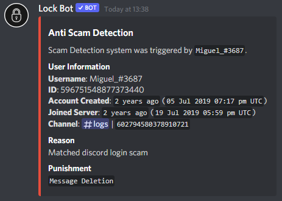

# Anti Scam

We've graciously been given a semi-public API in order to help stop scam links being sent in your server. Isn't that pretty cool? As scams are becoming more popular around Discord Servers, we just had to add this amazing feature, and, you can customise the punishment level! On all punishments, the message will be deleted for safety reasons, of course. Within the logs, we do not share the content of the message to protect you, your staff and/or your members. 

Upon the module enabled, each link sent will be scanned if it has been blacklisted within the database. If so, the message will automatically be deleted, depending on your punishment; punish the user and finally sends the trigger in your desired logs channel. 

## How do I set this up?

You can now do `[prefix]antiscam`, without any arguments you will be given choices what you can do. These include:

Enable - Enable the module.

Disable - Disables the module.

Current - Show's the status of the module \(enabled? and punishment\)

Kick - When a link is detected, the user will also be kicked \[and dm'ed\].

Ban - When a link is detected, the user will also be banned \[and dm'ed\].

None - Only deletes the message and sends the trigger warning in your desired logs channel.

### Examples

`[prefix]antiscam enable`

`[prefix]antiscam kick`

## What does the log actually show me?

We show information of the user, the reason the content was triggered and the punishment. An example of this can be:


You will need to setup the Logging System before setting up this module, you will be given a prompt how to do so if it is not setup or disabled.


## Why would I need this?

You may or may not need this, but as Discord Scams are getting popular, we recommend you have this, just in case. The database we use is super reliant, from the co owner of [Groovy - The Discord Music Bot](https://groovy.bot). Other links which aren't detected shall not be effected. 

## Can I get the API?

Simple answer is, no. This is a semi-public API to whom are trusted by the developer. 

## I have a scam link which wasn't detected by the API

If a scam link has been sent into your server and has not been detected by the API, you can send a request in our [Discord Server](https://discord.gg/RKHan5u), create a ticket and ask for **Miguel\_\#3687**. 


Proof will be needed in order to get the URL blacklisted. This could be a screenshot of the message or a message delete log. We cannot request to get the link blacklisted without some sort of proof.


