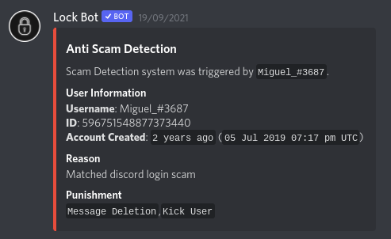

# Anti Scam

We have been graciously been given a Semi-Public API in order to help stop scam links being sent in your server. Isn't that pretty cool? As scams are becoming more popular around Discord Servers, we just had to add this amazing feature, and, you can customise the punishment level! On all punishments, the message will be deleted for safety reasons, of course. Within the logs, we do not share the content of the message to protect you, your staff and/or your members. 

## How do I set this up?

You can now do `[prefix]antiscam`, without any arguments you will be given choices what you can do. These include:

Enable - Enable the module.

Disable - Disables the module.

Current - Show's the status of the module \(enabled? and punishment\)

Kick - When a link is detected, the user will also be kicked \[and dm'ed\].

Ban - When a link is detected, the user will also be banned \[and dm'ed\].

None - Only deletes the message and sends the trigger warning in your desired logs channel.

An example of this could be:

`[prefix]antiscam enable`

`[prefix]antiscam kick`

## What does the log actually shows me?

We show information of the user, the reason the content was triggered and the punishment. An example of this can be:

## Why would I need this?

You may or may not need this, but as Discord Scams are getting popular, we recommend you have this, just in case. The database we use is super reliant, from the co owner of [Groovy - The Discord Music Bot](https://groovy.bot).

## Can I get the API?

Simple answer is, no. This is a semi-public API to whom are trusted by the developer. 

