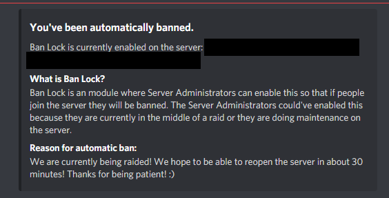
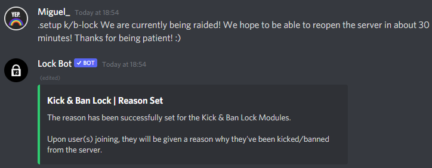

# Kick & Ban Lock Reason

### What does it exactly do?

Simply, you can set a reason whilst kick/ban lock is enabled to tell user's who join and get kicked/banned why they have been automatically removed from the server. This is an example of what the user's could see: 

### How do I set this up?

You can easily set this up by doing `[prefix]setup k/b-lock [reason]`


Replace `[prefix]` with your server prefix and `[reason]` with your reason why it's enabled.


Afterwards, you should be greeted with this embed:

### How do I see the current reason?

You can do `[prefix]setup k/b-lock current` and you'll be greeted with this:

If there is no reason you'll be greeted with: 

### How do I remove the reason?

You can do `[prefix]setup k/b-lock delete/remove` and you'll be greeted with: 

