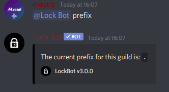

# Prefix Setup

## Server Prefix

A bot prefix is a symbol or letter that goes before a command to tell the bot that it is required to do something, by default the prefix is **`.`**

## Lost / Unknown Prefix

If you have forgotten your prefix or you are confused about what it could be, simply tag the bot \(**@LockBot prefix\)** and it will tell you what your current set prefix for the server is.

## Changing Server Prefix

Some users do not like the default prefix and may want to change it to something else to make it easier for them. We have made it possible for this to happen:


**Format: \[current prefix\]prefix \[New Prefix\]**

**User permissions required: server owner / server admin**

**Bot permissions required: None**– _It's advised that LockBot should have full server admin to carry out functions correctly._



If you have any issues then please contact the support team in our discord server for assistance.


