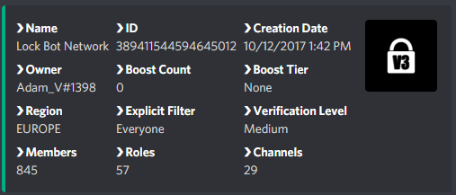

# Server Info

## Server Information

The server info command will display information on the current server.


**Format: \[prefix\]serverinfo**

**User permissions required: None**

**Bot permissions required: None** – _It's advised that LockBot should have the administrator permission to carry out functions correctly._


### This includes the following server data:

* Server owner tag
* Server name
* Server ID
* Total user amount
* Total role number
* Total channel amount
* Server creation date
* Server region

Amongst other information.

