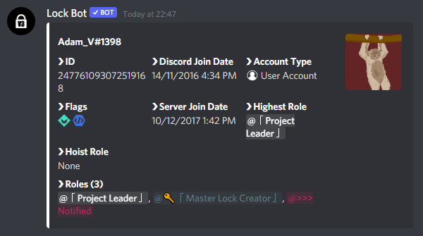

# Whois

## Whois Command

The whois command will display information on users that are mentioned or found by their ID.


**Format: \[prefix\]whois \[user mention \| user ID\]**

**User permissions required: None**

**Bot permissions required: None** – _It's advised that LockBot should have the administrator permission to carry out functions correctly._


### This includes the following user data:

* User’s username
* User’s ID
* User’s account type
* User’s account badges
* User’s account creation date
* User's server join date
* User’s server roles


_In an event of the error `unknown user` or `unknown ID` , make sure that the person is in the current server and if you are using the ID, make sure it's correct._


