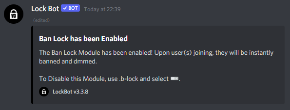
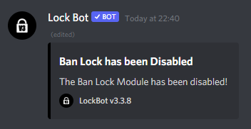

# Ban lock

Getting raided? Expecting unwelcome visitors to your server? Enabling ban lock will sort that issue out for you.


**Format: \[prefix\]b-lock**

**User permissions required: LockBot Admin or Server Admin**

**Bot permissions required: Ban Members -** _It's advised that LockBot has the administrator permission to carry out all functions correctly._


If the command has been activated successfully \(as indicated in the screenshot below\), it should ban any members that join the server while the command is active. A succession message will be sent to the channel that the command was run in.

Users that are affected by this will receive a DM from the bot informing them about this lock being enabled which was why they were banned.

To disable it just run the command again and select the other toggle. It will display this message if successful: 

