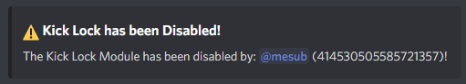

# Kick Lock

Expecting a large number of people that you don't really want? Enabling kick lock will sort that issue for you.


**Format: \[prefix\]k-lock**

**User permissions required: LockBot Admin or Server Admin**

**Bot permissions required: Kick Members -** _It's advised that LockBot has the administrator flag to carry out all functions correctly._


If the command has been activated successfully \(as shown in the screenshot below\), it should kick any members that join the server while the command is active. A succession message will be sent to the channel that the command was run in.

Users that are affected by this will receive a DM from the bot informing them about this lock being enabled which was why they were kicked.

To disable it just run the command again and select the other toggle. It will display this message if successful: 

