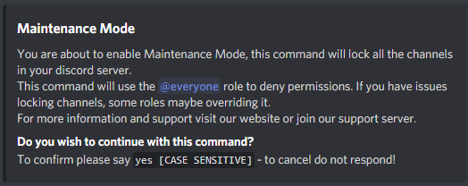

# Maintenance Mode

## Maintenance Mode

One of the most popular LockBot commands, and can be very helpful as a server tool as well as a lockdown tool which some users prefer to use it as.

Maintenance mode has been a challenge to maintain but it is back, stronger as ever.


**Note: Due to the high resource usage of m-mode, we have set the channel limit to 40.**



**Format: \[prefix\]m-mode**

**User Perms Required: LockBot Admin, Server Admin**

**Bot Perms Required: Manage channels, Manage messages** – _It's advised that LockBot should have full server admin to carry out functions correctly._


Upon the command being given, LockBot will display a notice that should be read for your information. It will also ask you if you wish to continue with the command. If you do you will need to reply “yes” \(keep in mind this is case sensitive\). If you do not reply, it will time out and cancel. This feature is in place as this command can be quite destructive if not used correctly.

### What does this command actually do?

Once activated, this command will lock all of the server's channels using the @everyone role _\(if other roles are set to override this then it may not work correctly, however this may be to your advantage\)._ It will also create a temporary channel with some basic info, this can be removed if desired. Users with server admin or role overrides will still be able to see the channels in the server. _If you're still having issues using m-mode please contact us via the discord support server. **Read this carefully first.**_

Looking to unlock your server? Have a look here:



