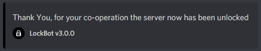

# Server Unlock

Finally! It seems like those raiders have gone \(for now at least!\) and you need to open your server again; s-unlock should do the job.


**Format: \[prefix\]s-unlock**

**User permissions required: LockBot Admin or Server Admin**

**Bot permissions required: Administrator** _\(Ban Members / Kick Members may work but is not supported\)_


Upon running this command, the bot will send a succession message and send a message in the logs channel \(if configured, as shown in the screenshot below\). This command will disable **maintenance mode, ban lock and kick lock** meaning that members can join the server again.

