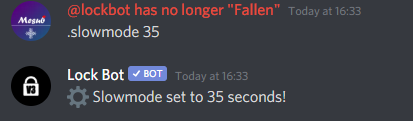

# Slowmode

Are people sending messages too fast for your liking? You can slow them down with slowmode.


**Format: \[prefix\]slowmode \[time in seconds \(no units\)\]**

**User permissions required: Manage messages**

**Bot permissions required: Manage messages** – _It's advised that LockBot should have the administrator permission to carry out functions correctly._


Once you've initiated the command, the bot will activate slowmode and send a confirmation message.

